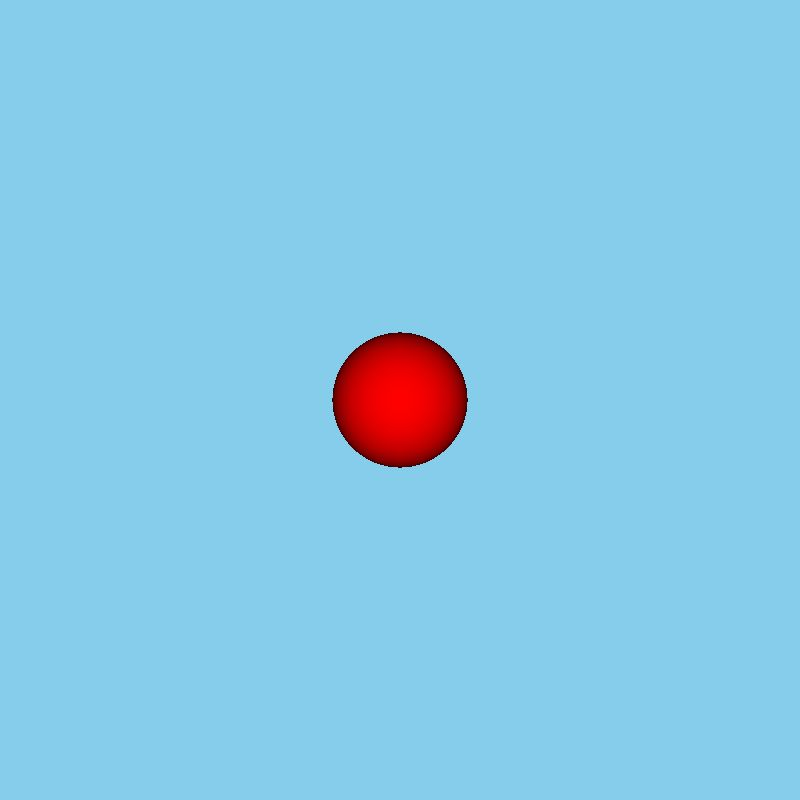
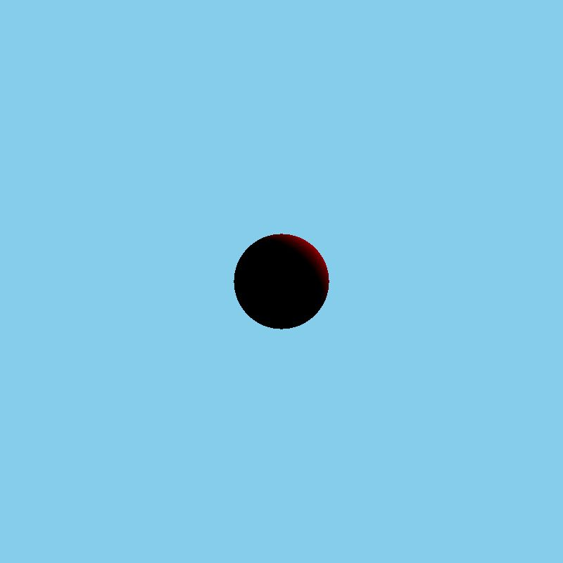

# C-Ray-on
A 3-D Ray Tracer built using C which relies on Lambertian Reflectance Model to illuminate objects.
Currently only sphere is supported, but more shapes to be added soon.

## Usage
Built using Windows but should also run on Linux.
Run `make`

## Outputs
### Light faces the sphere head on

### Light is above and to the side

### Light is above and to the front

